---
## Author
author:
  name: Агаева Зейнаб Фуад кызы
  email: 1032245473@rudn.ru
  affiliation:
    - name: Российский университет дружбы народов
      country: Российская Федерация
      postal-code: 117198
      city: Москва
      address: ул. Миклухо-Маклая, д. 6

## Title
title: "Отчёт по лабораторной работе №2"
subtitle: "Простые сети в GNS3. Анализ трафика"
license: "CC BY"
---

# Цель работы

Построение простейших моделей сети на базе коммутатора и маршрутизаторов FRR и VyOS в GNS3, анализ трафика посредством Wireshark.

# Выполнение лабораторной работы

## Моделирование простейшей сети на базе коммутатора в GNS3

Создаю в GNS3 проект и размещаю в рабочей области два оконечных устройства VPCS и коммутатор Ethernet. Устройствам присваиваю имена `PC1-zfagaeva`, `PC2-zfagaeva` и `msk-zfagaeva-sw-01`. Оконечные устройства соединяю с коммутатором, в результате получаю простейшую локальную сеть на базе Ethernet-коммутатора (см. рис. [@fig-001]).

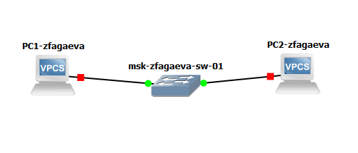{ #fig-001 width=70% }

Запускаю `PC1-zfagaeva` и открываю его консоль. Для просмотра доступных команд VPCS и их синтаксиса использую справочную команду `?`. В выводе отображаются команды для настройки IP-адресации, проверки соединения, просмотра параметров узла и выполнения других операций (см. рис. [@fig-002]).

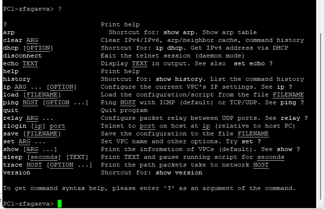{ #fig-002 width=70% }

Для уточнения синтаксиса настройки IP-адреса использую команду `ip ?`. Узлу `PC1-zfagaeva` назначаю адрес `192.168.1.11/24` и шлюз `192.168.1.1` командой `ip 192.168.1.11/24 192.168.1.1`. После настройки сохраняю конфигурацию командой `save`. В выводе VPCS отображаются адрес `192.168.1.11`, маска `255.255.255.0` и адрес шлюза `192.168.1.1` (см. рис. [@fig-003]).

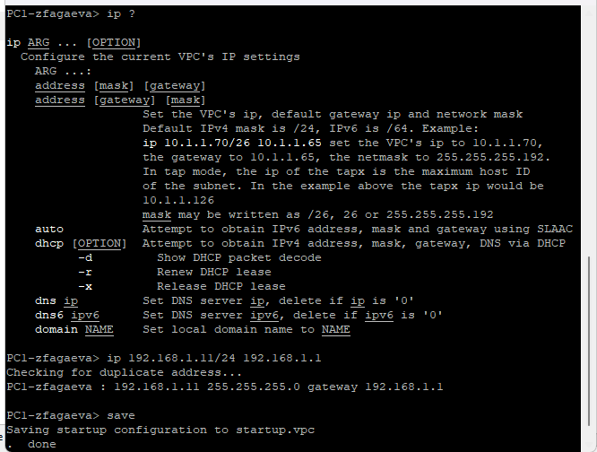{ #fig-003 width=70% }

Узлу `PC2-zfagaeva` назначаю IP-адрес `192.168.1.12/24`. После настройки проверяю связь между двумя оконечными устройствами командой `ping`. Узел `PC1-zfagaeva` успешно получает ответы от `192.168.1.12`, а `PC2-zfagaeva` — от `192.168.1.11`. Потерь пакетов не наблюдается, что подтверждает корректную работу соединения через Ethernet-коммутатор и принадлежность узлов одной подсети `192.168.1.0/24` (см. рис. [@fig-004]).

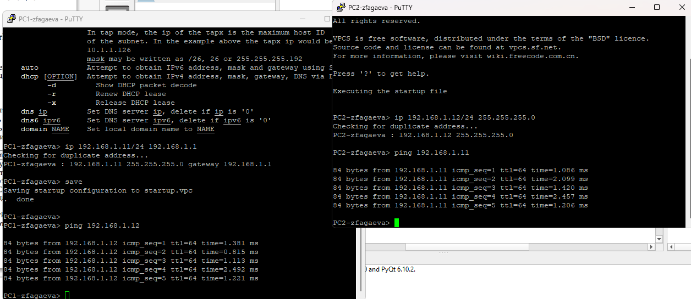{ #fig-004 width=70% }

## Анализ трафика в GNS3 посредством Wireshark

Для анализа сетевого обмена запускаю захват трафика на соединении между `PC1-zfagaeva` и коммутатором `msk-zfagaeva-sw-01`. После запуска захвата на соответствующем соединении в GNS3 отображается значок анализатора трафика (см. рис. [@fig-005]).

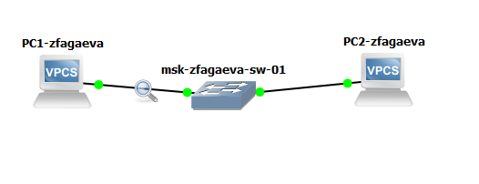{ #fig-005 width=70% }

После запуска устройств в Wireshark фиксируются ARP-сообщения. В частности, узел с MAC-адресом `00:50:79:66:68:00` передает широковещательные Gratuitous ARP Request для IP-адреса `192.168.1.11`. Ethernet-кадр направляется на широковещательный MAC-адрес `ff:ff:ff:ff:ff:ff`, при этом IP-адрес отправителя и запрашиваемый IP-адрес совпадают и равны `192.168.1.11`. Gratuitous ARP может использоваться для объявления собственного соответствия IP- и MAC-адресов, обновления ARP-таблиц соседних устройств и обнаружения возможного конфликта IP-адресов. В захвате также присутствуют служебные сообщения ICMPv6 Router Solicitation, не относящиеся к проверяемому обмену IPv4 (см. рис. [@fig-006]).

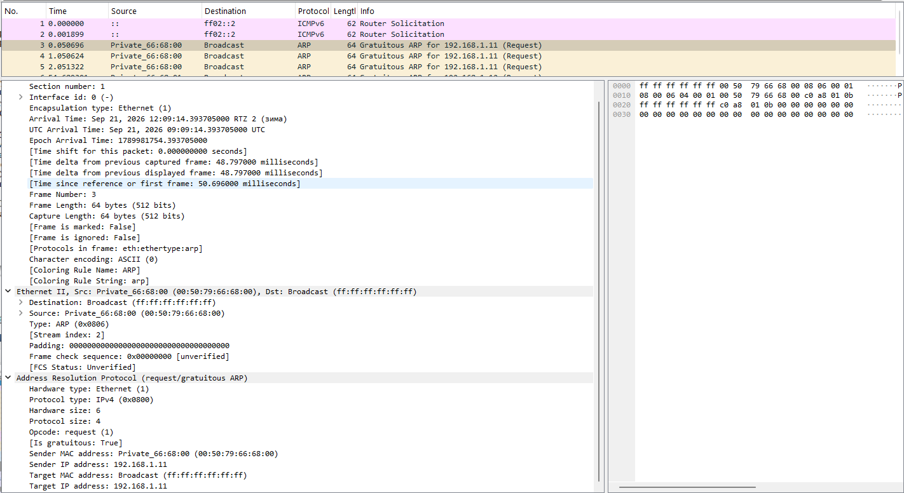{ #fig-006 width=70% }

В терминале `PC2-zfagaeva` просматриваю справку по команде `ping` с помощью `ping ?`. VPCS позволяет выполнять проверку доступности в нескольких режимах: стандартный режим `ICMP`, режим `UDP` и режим `TCP`. Параметр `-c` определяет количество отправляемых запросов, параметр `-1` выбирает ICMP, `-2` — UDP, а `-3` — TCP (см. рис. [@fig-007]).

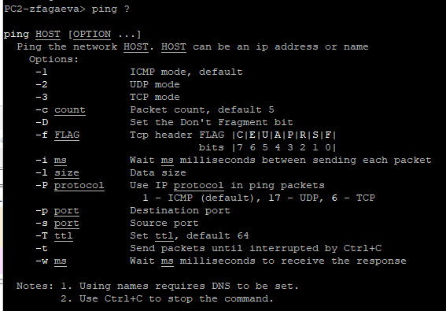{ #fig-007 width=70% }

Выполняю с `PC2-zfagaeva` один ICMP эхо-запрос к узлу `192.168.1.11` командой `ping 192.168.1.11 -c 1 -1`. В ответ получено сообщение размером `84` байта с `ttl=64`, что подтверждает доступность `PC1-zfagaeva` по протоколу ICMP (см. рис. [@fig-008]).

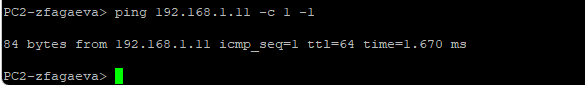{ #fig-008 width=70% }

В Wireshark перед ICMP-обменом наблюдается разрешение IP-адреса в MAC-адрес посредством ARP. Узел `192.168.1.12` передает широковещательный запрос `Who has 192.168.1.11? Tell 192.168.1.12`, после чего получает ответ о соответствии адреса `192.168.1.11` MAC-адресу `00:50:79:66:68:00`. Далее фиксируется ICMP Echo Request от `192.168.1.12` к `192.168.1.11` и соответствующий ICMP Echo Reply в обратном направлении. Для запроса указаны тип `8` (`Echo request`) и код `0`, а для ответа используется тип `0` (`Echo reply`). Наличие пары запрос–ответ подтверждает успешную проверку соединения (см. рис. [@fig-009]).

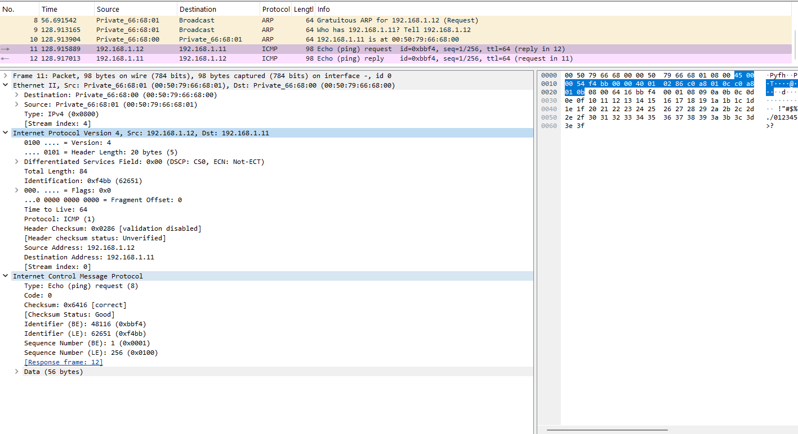{ #fig-009 width=70% }

Далее выполняю один запрос в UDP-режиме командой `ping 192.168.1.11 -c 1 -2`. Узел `PC2-zfagaeva` получает ответ от `192.168.1.11`, что подтверждает возможность обмена UDP-датаграммами между оконечными устройствами (см. рис. [@fig-010]).

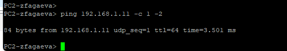{ #fig-010 width=70% }

В Wireshark UDP-проверка отображается как обмен запросом и ответом службы Echo. Запрос передается от `192.168.1.12` к `192.168.1.11` по протоколу UDP. В исследуемом пакете используется исходный порт `61479` и порт назначения `7`, соответствующий службе Echo. Полезная нагрузка UDP составляет `56` байт. После приема запроса удаленный узел возвращает Echo Response. В отличие от обычного `ping`, данный режим не использует ICMP Echo Request и ICMP Echo Reply, а проверяет обмен посредством UDP (см. рис. [@fig-011]).

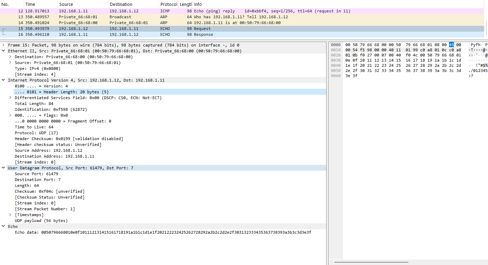{ #fig-011 width=70% }

Выполняю один запрос в TCP-режиме командой `ping 192.168.1.11 -c 1 -3`. В терминале отображаются этапы `Connect`, `SendData` и `Close`, соответствующие установлению TCP-соединения, передаче данных и последующему закрытию соединения (см. рис. [@fig-012]).

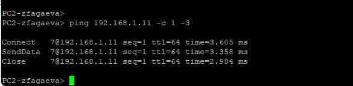{ #fig-012 width=70% }

При анализе TCP-обмена в Wireshark наблюдается установка соединения с портом `7` узла `192.168.1.11`. Сначала `192.168.1.12` передает сегмент `SYN`, удаленный узел отвечает `SYN, ACK`, после чего отправитель подтверждает соединение сегментом `ACK`. После трехэтапного TCP-рукопожатия выполняется обмен данными Echo, а затем соединение закрывается с использованием флагов `FIN` и `ACK`. Захваченная последовательность подтверждает успешное установление TCP-соединения и передачу данных между узлами (см. рис. [@fig-013]).

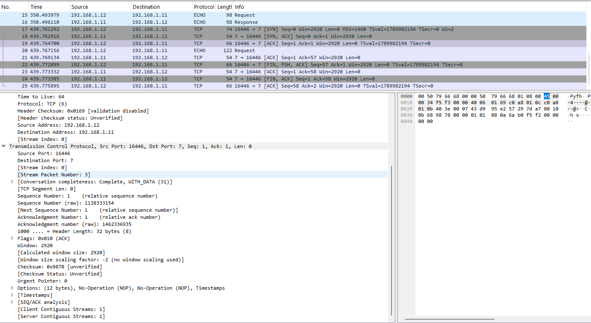{ #fig-013 width=70% }

После завершения анализа останавливаю захват трафика в Wireshark и работу устройств проекта.

## Моделирование простейшей сети на базе маршрутизатора FRR в GNS3

Создаю топологию, включающую оконечное устройство `PC1-zfagaeva`, Ethernet-коммутатор `msk-zfagaeva-sw-01` и маршрутизатор FRR `msk-zfagaeva-gw-01`. Оконечное устройство подключаю к коммутатору, а коммутатор — к маршрутизатору. На соединении между коммутатором и маршрутизатором включаю захват трафика для последующего анализа в Wireshark (см. рис. [@fig-014]).

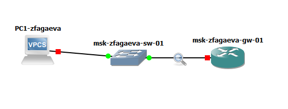{ #fig-014 width=70% }

В консоли FRR перехожу в режим конфигурирования командой `configure terminal`. Изменяю имя маршрутизатора командой `hostname msk-zfagaeva-gw-01`, выхожу из режима конфигурирования и сохраняю настройки командой `write memory`. Затем настраиваю интерфейс `eth0`, присваивая ему адрес `192.168.1.1/24`. После настройки интерфейс используется в качестве шлюза локальной сети `192.168.1.0/24` (см. рис. [@fig-015]).

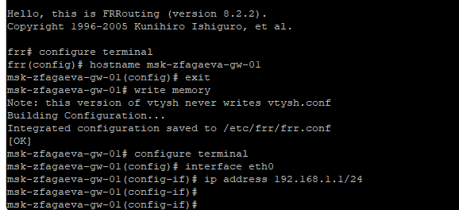{ #fig-015 width=70% }

Проверяю текущую конфигурацию маршрутизатора командой `show running-config`. В конфигурации присутствует имя `msk-zfagaeva-gw-01`, а для интерфейса `eth0` указан IP-адрес `192.168.1.1/24`. Это подтверждает сохранение внесенных параметров (см. рис. [@fig-016]).

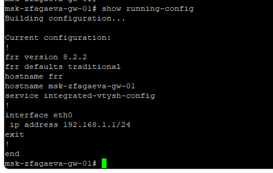{ #fig-016 width=70% }

Командой `show interface brief` проверяю состояние интерфейсов FRR. Интерфейс `eth0` находится в состоянии `up` и имеет адрес `192.168.1.1/24`. Остальные Ethernet-интерфейсы не используются и находятся в состоянии `down` (см. рис. [@fig-017]).

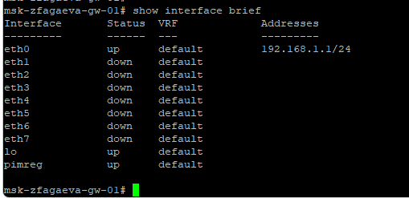{ #fig-017 width=70% }

На `PC1-zfagaeva` настраиваю IP-адрес `192.168.1.10/24` и шлюз `192.168.1.1`. Командой `show ip` проверяю параметры сетевого интерфейса. После этого выполняю `ping 192.168.1.1`. Маршрутизатор успешно отвечает на все ICMP эхо-запросы, потери пакетов отсутствуют, следовательно, оконечный узел и интерфейс `eth0` FRR корректно взаимодействуют в одной подсети (см. рис. [@fig-018]).

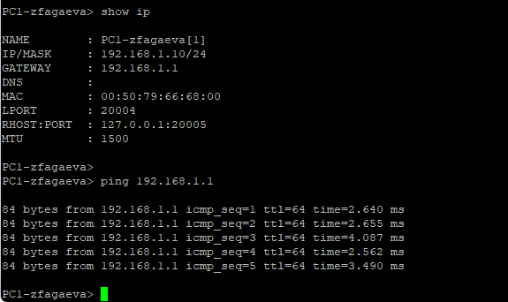{ #fig-018 width=70% }

В Wireshark наблюдается двусторонний обмен ICMP между адресами `192.168.1.10` и `192.168.1.1`. Для каждого ICMP Echo Request от `PC1-zfagaeva` маршрутизатор передает Echo Reply. В захвате также присутствует ARP-обмен: маршрутизатор с адресом `192.168.1.1` запрашивает MAC-адрес узла `192.168.1.10`, после чего получает ответ, содержащий MAC-адрес `00:50:79:66:68:00`. ARP обеспечивает получение канального адреса получателя перед передачей IPv4-пакетов в пределах локального сегмента, а последующий ICMP-обмен подтверждает работоспособность соединения (см. рис. [@fig-019]).

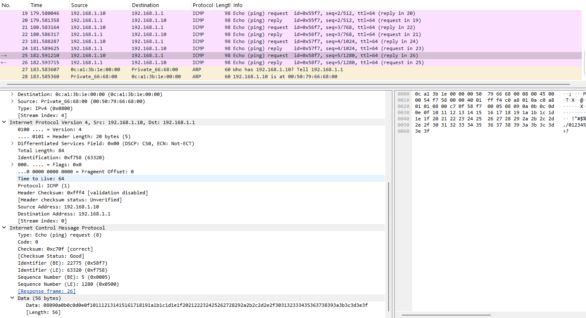{ #fig-019 width=70% }

После завершения проверки останавливаю захват пакетов в Wireshark и работу устройств проекта.

## Моделирование простейшей сети на базе маршрутизатора VyOS в GNS3

Создаю топологию с оконечным устройством `PC1-zfagaeva`, Ethernet-коммутатором `msk-zfagaeva-sw-01` и маршрутизатором VyOS `msk-zfagaeva-gw-01`. Узлы соединяю последовательно: VPCS — коммутатор — маршрутизатор. На соединении между коммутатором и VyOS включаю захват трафика для анализа сетевого обмена (см. рис. [@fig-020]).

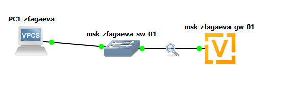{ #fig-020 width=70% }

После входа в VyOS перехожу в режим конфигурирования командой `configure`. Задаю маршрутизатору имя `msk-zfagaeva-gw-01` командой `set system host-name msk-zfagaeva-gw-01`. Для интерфейса `eth0` удаляю получение адреса по DHCP командой `del interfaces ethernet eth0 address dhcp`, после чего назначаю статический адрес командой `set interfaces ethernet eth0 address 192.168.1.1/24`. Командой `compare` просматриваю подготовленные изменения: DHCP-адрес удаляется, а статический адрес `192.168.1.1/24` и новое имя устройства добавляются. Затем применяю настройки командой `commit` и сохраняю конфигурацию командой `save` (см. рис. [@fig-021]).

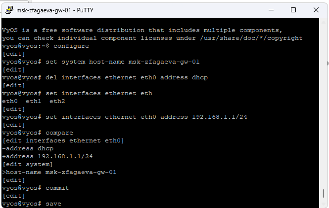{ #fig-021 width=70% }

После сохранения конфигурации выполняю команду `show interfaces`. Для интерфейса `eth0` отображается адрес `192.168.1.1/24` и MAC-адрес `0c:01:0e:36:00:00`. Интерфейсы `eth1` и `eth2` IP-адресов не имеют. Полученные данные подтверждают корректную настройку интерфейса локальной сети маршрутизатора (см. рис. [@fig-022]).

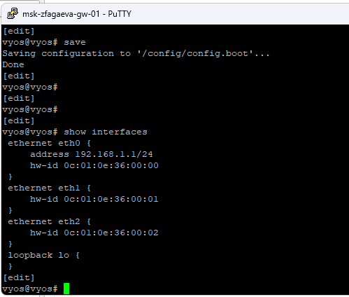{ #fig-022 width=70% }

На узле `PC1-zfagaeva` использую адрес `192.168.1.10/24` и шлюз `192.168.1.1`. Проверяю параметры командой `show ip`, после чего отправляю ICMP эхо-запросы на `192.168.1.1`. От маршрутизатора поступают ответы на все запросы с `ttl=64`, что подтверждает доступность интерфейса VyOS и корректную работу локального соединения (см. рис. [@fig-023]).

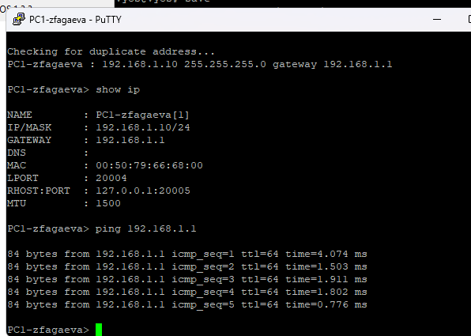{ #fig-023 width=70% }

В Wireshark фиксируется ARP- и ICMP-трафик между `192.168.1.10` и `192.168.1.1`. Из ARP-сообщения видно, что адресу маршрутизатора `192.168.1.1` соответствует MAC-адрес `0c:01:0e:36:00:00`. После разрешения канальных адресов `PC1-zfagaeva` передает ICMP Echo Request к `192.168.1.1`, а VyOS возвращает ICMP Echo Reply. В захвате присутствуют последовательные пары запросов и ответов, что подтверждает отсутствие проблем с IP-адресацией и передачей пакетов между оконечным устройством и маршрутизатором (см. рис. [@fig-024]).

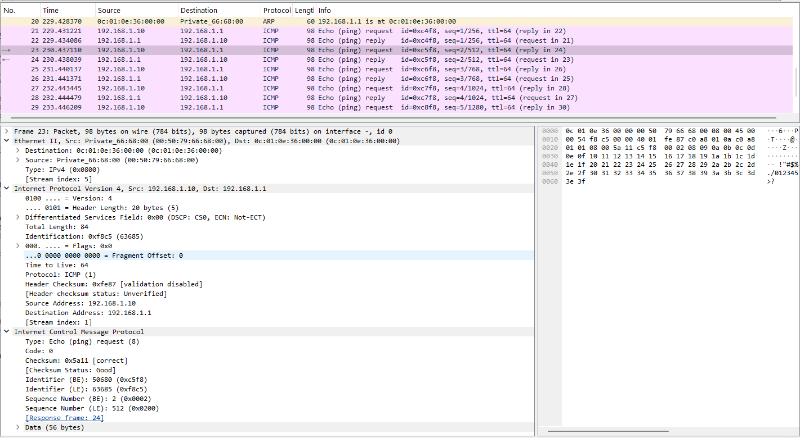{ #fig-024 width=70% }

После завершения анализа останавливаю захват пакетов в Wireshark, останавливаю все устройства проекта и завершаю работу с GNS3.

# Вывод

В ходе лабораторной работы были построены и настроены простые сети в GNS3 на базе Ethernet-коммутатора, маршрутизаторов FRR и VyOS. Была проверена связность между узлами с помощью `ping`, а в Wireshark проанализированы ARP-, ICMP-, UDP- и TCP-пакеты. Результаты подтвердили корректность настроенной IP-адресации и работоспособность созданных сетевых соединений.
