---
## Author
author:
  name: Агаева Зейнаб Фуад кызы
  email: 1032245473@rudn.ru
  affiliation:
    - name: Российский университет дружбы народов
      country: Российская Федерация
      postal-code: 117198
      city: Москва
      address: ул. Миклухо-Маклая, д. 6

## Title
title: Домашнее задание №3
subtitle: Анализ трафика в Wireshark
license: CC BY
date: today
date-format: "YYYY-MM-DD"
---

# Цели и задачи работы

## Цель лабораторной работы

Изучить MAC-адресацию, получить практические навыки захвата и анализа сетевого трафика в Wireshark, исследовать работу протоколов `ARP`, `ICMP`, `HTTP`, `DNS`, `TCP`, `UDP` и `QUIC`, а также проанализировать процесс установки TCP-соединения.

# Процесс выполнения лабораторной работы

## Определяю параметры сетевого интерфейса

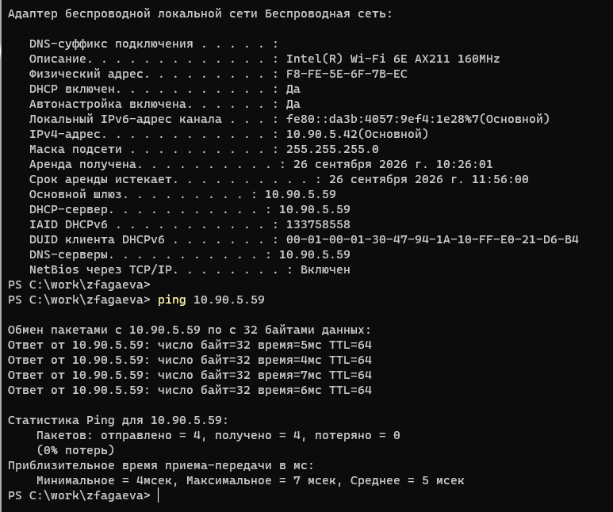{ #fig:001 width=70% height=70% }

## Анализирую ICMP Echo Request

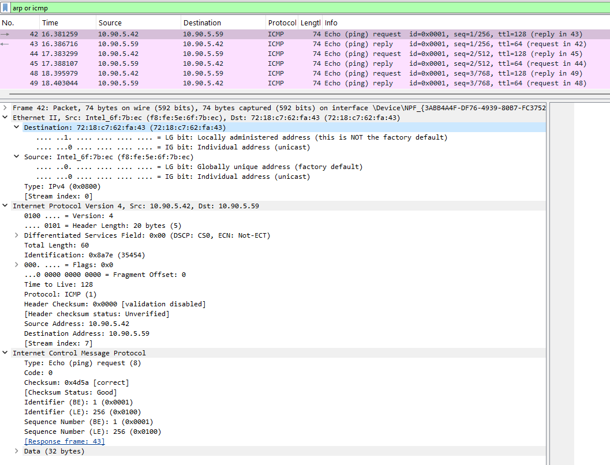{ #fig:002 width=70% height=70% }

## Анализирую ICMP Echo Reply

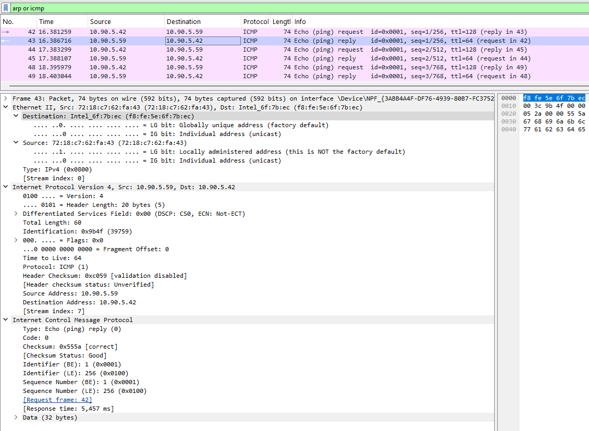{ #fig:003 width=70% height=70% }

## Исследую ARP-запрос

{ #fig:004 width=70% height=70% }

## Исследую ARP-ответ

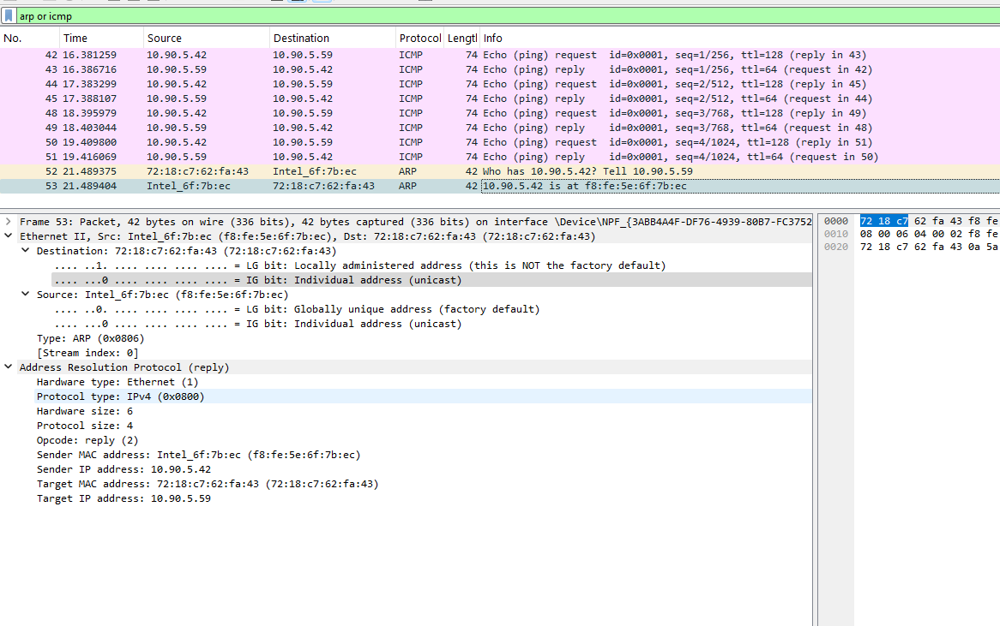{ #fig:005 width=70% height=70% }

## Проверяю доступность удалённого узла

{ #fig:006 width=70% height=70% }

## Анализирую ICMP-запрос к удалённому узлу

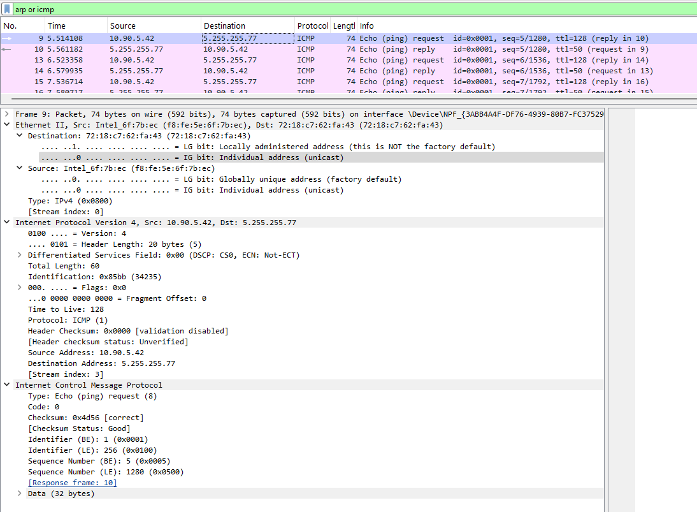{ #fig:007 width=70% height=70% }

## Анализирую ICMP-ответ удалённого узла

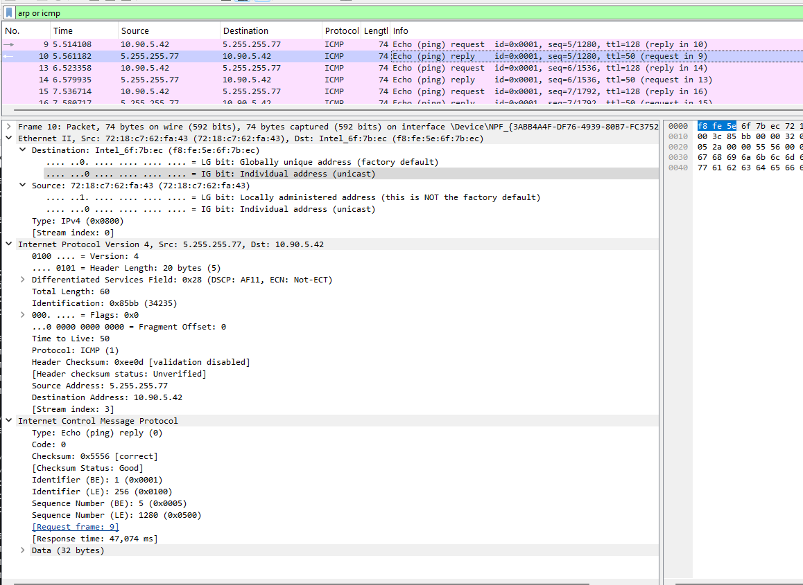{ #fig:008 width=70% height=70% }

# Анализ протоколов транспортного уровня

## Исследую HTTP-запрос и TCP

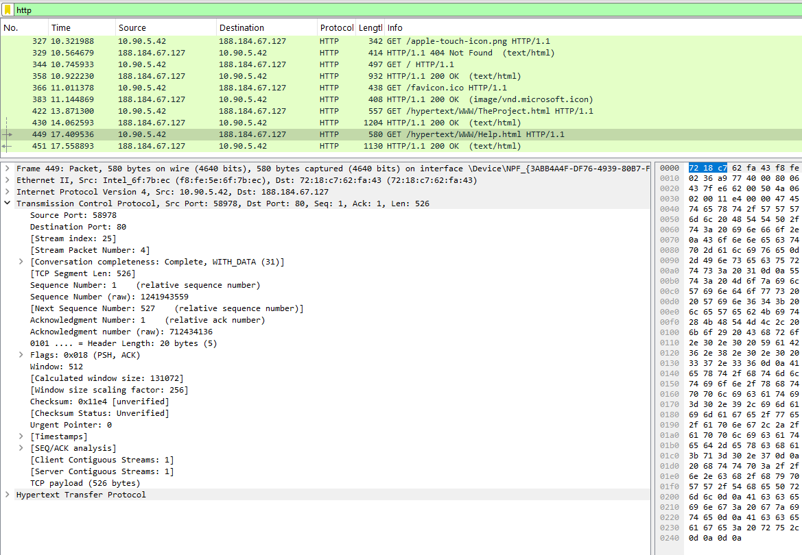{ #fig:009 width=70% height=70% }

## Исследую HTTP-ответ

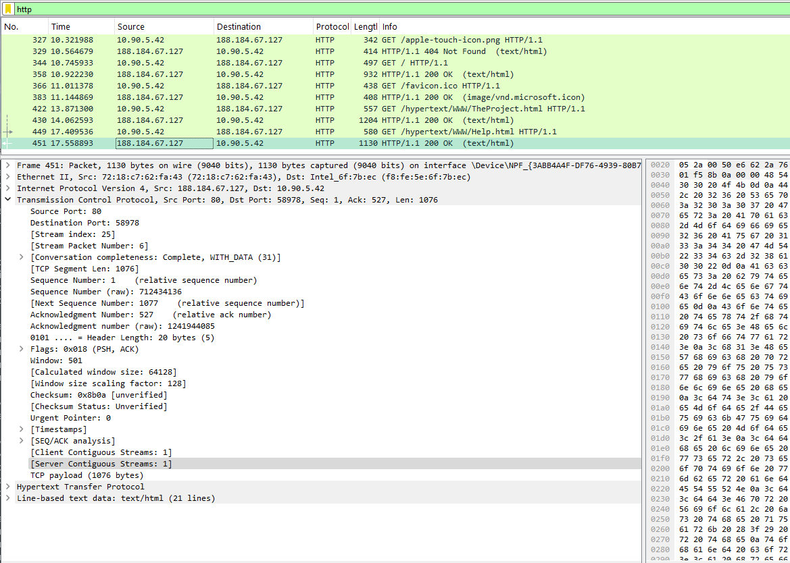{ #fig:010 width=70% height=70% }

## Анализирую DNS-запрос

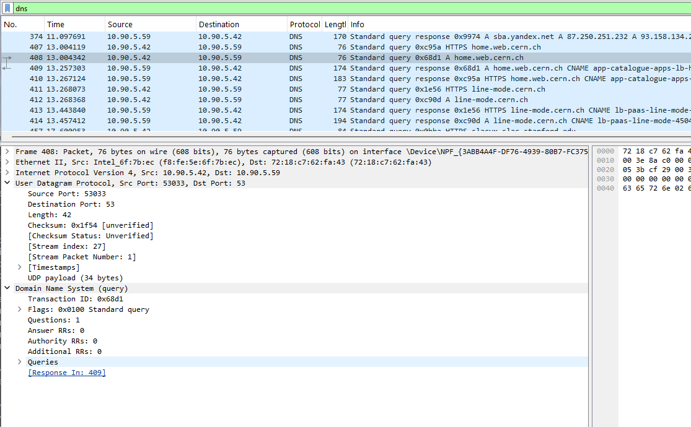{ #fig:011 width=70% height=70% }

## Анализирую DNS-ответ

{ #fig:012 width=70% height=70% }

## Исследую протокол QUIC

{ #fig:013 width=70% height=70% }

## Анализирую QUIC Handshake

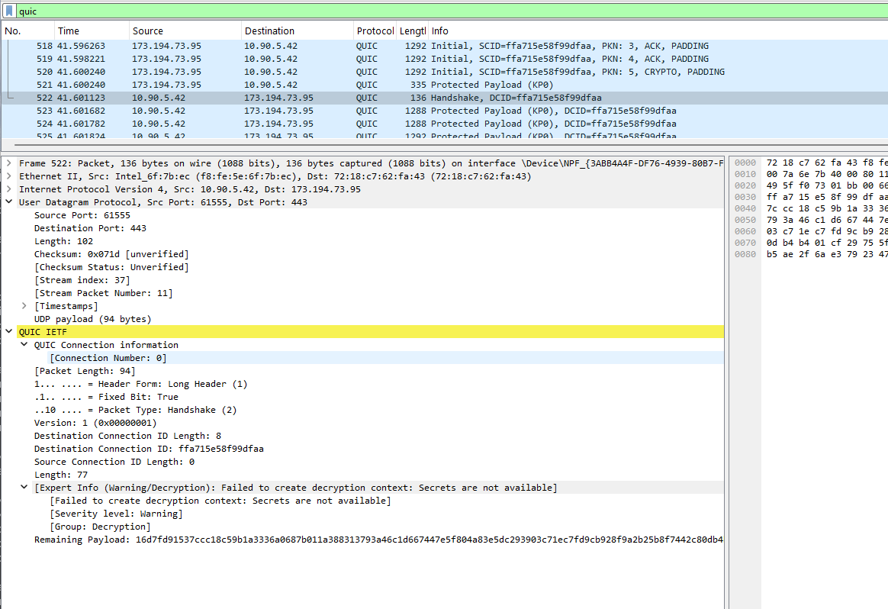{ #fig:014 width=70% height=70% }

# Анализ TCP Handshake

## Исследую установление TCP-соединения

{ #fig:015 width=70% height=70% }

## Анализирую TCP SYN-ACK

{ #fig:016 width=70% height=70% }

## Строю график потока TCP

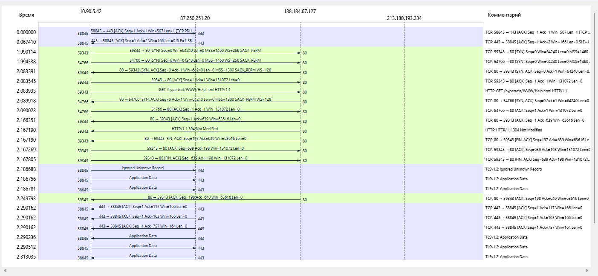{ #fig:017 width=70% height=70% }

## Анализирую изменение Seq и Ack

{ #fig:018 width=70% height=70% }

# Выводы по проделанной работе

## Вывод

В ходе лабораторной работы были изучены параметры сетевых интерфейсов и структура MAC-адресов.

С помощью Wireshark был выполнен захват и анализ кадров протоколов `ARP` и `ICMP`.

Были определены MAC- и IP-адреса источников и получателей сетевых пакетов.

Проанализирована работа протоколов `HTTP` и `TCP`, а также передача DNS-запросов и ответов по протоколу `UDP`.

Был исследован протокол `QUIC`, работающий поверх UDP и использующий защищённое установление соединения.

Также был подробно рассмотрен процесс TCP handshake, состоящий из последовательности сообщений `SYN`, `SYN-ACK` и `ACK`.

В результате были получены практические навыки анализа сетевого трафика и структуры протоколов различных уровней модели сети.