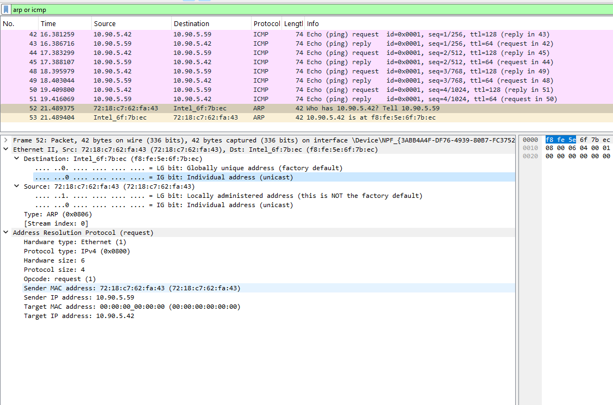
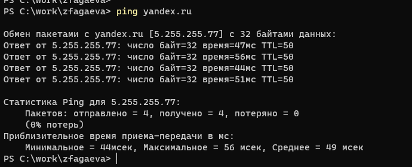
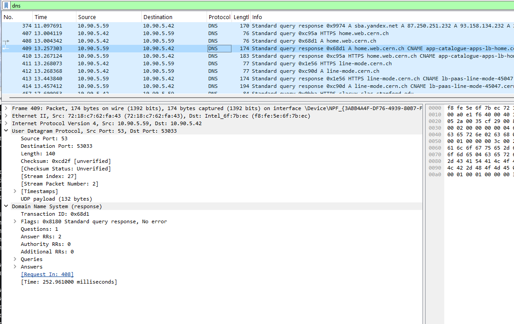
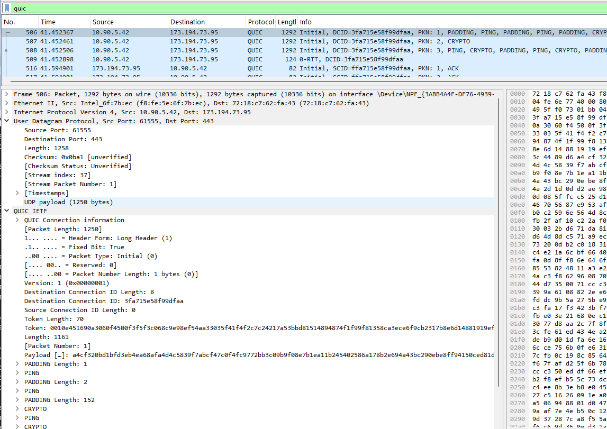
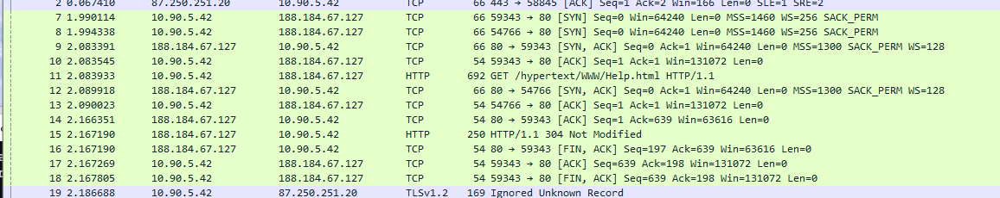
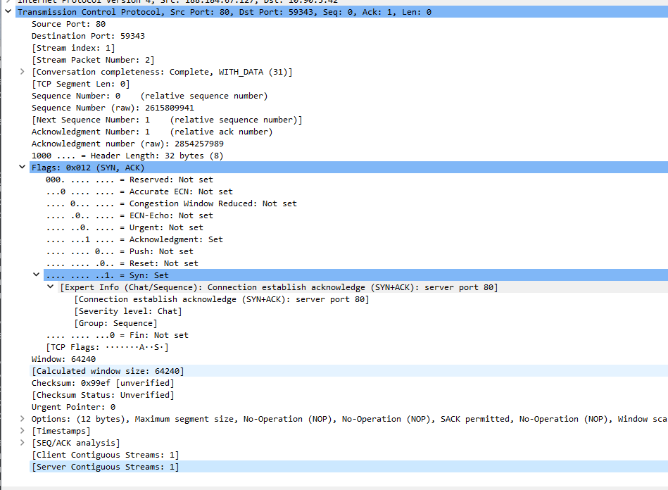
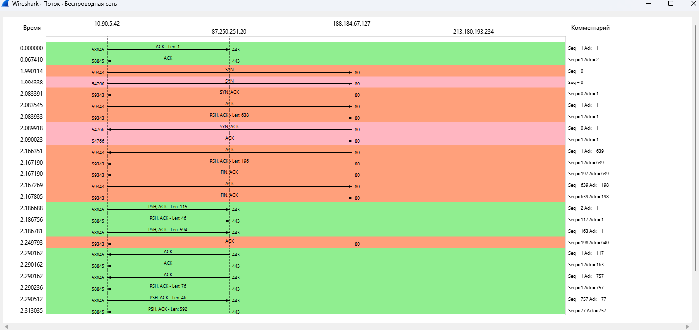

---
## Author
author:
  name: Агаева Зейнаб Фуад кызы
  email: 1032245473@rudn.ru
  affiliation:
    - name: Российский университет дружбы народов
      country: Российская Федерация
      postal-code: 117198
      city: Москва
      address: ул. Миклухо-Маклая, д. 6

## Title
title: "Отчёт по домашнему заданию №3"
subtitle: "Анализ трафика в Wireshark"
license: "CC BY"
---

# Цель работы

Изучение посредством Wireshark кадров Ethernet, анализ PDU протоколов транспортного и прикладного уровней стека TCP/IP.

# Выполнение лабораторной работы № 11

## 11.3.1. MAC-адресация

Для изучения параметров сетевого подключения в операционной системе Windows использую команду `ipconfig`. Без дополнительных параметров команда выводит основные сведения о сетевых интерфейсах: IPv4- и IPv6-адреса, маску подсети и адрес шлюза по умолчанию. Для получения расширенной информации использую вариант `ipconfig /all`, который дополнительно отображает описание сетевого адаптера, физический MAC-адрес, состояние DHCP, адрес DHCP-сервера, DNS-серверы, срок аренды IPv4-адреса и другие параметры.

В качестве активного интерфейса используется беспроводной адаптер `Intel(R) Wi-Fi 6E AX211 160MHz` (см. рис. [@fig-001]). Его физический адрес равен `F8-FE-5E-6F-7B-EC`. Для интерфейса назначен IPv4-адрес `10.90.5.42` с маской подсети `255.255.255.0`. Маска соответствует префиксу `/24`, поэтому адрес сети имеет вид `10.90.5.0/24`. Также интерфейсу назначен локальный IPv6-адрес канала, начинающийся с `fe80::`, который предназначен для взаимодействия в пределах локального сегмента IPv6.

Из расширенного вывода видно, что получение сетевых параметров по DHCP включено. В качестве DHCP-сервера указан узел `10.90.5.59`. Этот же адрес используется в качестве основного шлюза и DNS-сервера. Следовательно, узел `10.90.5.59` выполняет для компьютера функции маршрутизатора локальной сети и предоставляет ряд сетевых служб. В выводе также присутствуют время получения и окончания аренды IPv4-адреса, идентификатор IAID и DUID DHCPv6.

Для проверки доступности шлюза выполняю команду `ping 10.90.5.59`. Отправляются четыре ICMP Echo Request, на каждый из которых приходит ICMP Echo Reply. Потери отсутствуют: отправлено `4`, получено `4`, потеряно `0`. Время ответа составляет от `4` до `7` мс, среднее значение равно `5` мс. Значение `TTL=64` в ответах характерно для пакетов, поступающих от сетевого устройства или системы, расположенной непосредственно рядом с исследуемым компьютером.

{ #fig-001 width=70% }

MAC-адрес беспроводного интерфейса имеет шестнадцатеричное представление `F8-FE-5E-6F-7B-EC` и состоит из `48` бит, то есть из шести октетов:

`F8 : FE : 5E : 6F : 7B : EC`

Первые три октета `F8-FE-5E` образуют организационно уникальный идентификатор производителя, то есть OUI. С учётом того, что исследуемый сетевой адаптер определяется системой как `Intel(R) Wi-Fi 6E AX211 160MHz`, эта часть MAC-адреса относится к производителю сетевого оборудования. Оставшиеся три октета `6F-7B-EC` используются для идентификации конкретного сетевого интерфейса в пределах выделенного производителю адресного пространства.

Для определения типа MAC-адреса рассматриваю первый октет `F8`. В двоичной системе:

`F8₁₆ = 11111000₂`.

Младший бит первого октета является битом `I/G` (Individual/Group). Его значение равно `0`, поэтому адрес `F8-FE-5E-6F-7B-EC` является **индивидуальным**, то есть unicast-адресом. Следующий бит является битом `U/L` (Universal/Local). Он также равен `0`, поэтому адрес является **глобально администрируемым**, то есть назначенным производителем, а не сформированным локально операционной системой или администратором.

Следовательно, MAC-адрес `F8-FE-5E-6F-7B-EC` является индивидуальным глобально администрируемым MAC-адресом беспроводного интерфейса.

## 11.3.2. Анализ кадров канального уровня в Wireshark

После установки Wireshark запускаю программу и выбираю активный беспроводной сетевой интерфейс. Начинаю захват трафика, после чего выполняю ранее рассмотренную команду `ping 10.90.5.59` для шлюза по умолчанию. После получения ответов останавливаю захват и устанавливаю фильтр отображения:

`arp or icmp`

В результате в списке остаются только кадры, относящиеся к протоколам ARP и ICMP. Среди них присутствуют ICMP Echo Request от моего компьютера `10.90.5.42` к шлюзу `10.90.5.59` и соответствующие ICMP Echo Reply в обратном направлении.

Для анализа эхо-запроса выбираю кадр № 42 (см. рис. [@fig-002]). Размер кадра составляет `74` байта, или `592` бита. Wireshark определяет формат кадра как `Ethernet II`. В заголовке Ethernet II указаны следующие MAC-адреса:

- источник: `F8:FE:5E:6F:7B:EC`;
- получатель: `72:18:C7:62:FA:43`.

MAC-адрес источника `F8:FE:5E:6F:7B:EC` принадлежит беспроводному сетевому интерфейсу компьютера. Wireshark указывает для него `LG bit: Globally unique address` и `IG bit: Individual address`, следовательно, это глобально администрируемый индивидуальный адрес.

MAC-адрес назначения `72:18:C7:62:FA:43` принадлежит следующему узлу канального уровня, в данном случае шлюзу. Первый октет равен `72₁₆ = 01110010₂`. Его младший бит равен `0`, поэтому адрес является индивидуальным. Бит `U/L` равен `1`, поэтому Wireshark определяет его как `Locally administered address`. Следовательно, адрес шлюза является индивидуальным локально администрируемым MAC-адресом.

Поле `Type` заголовка Ethernet II имеет значение `IPv4 (0x0800)`, то есть полезная нагрузка Ethernet содержит IPv4-пакет. В IPv4-заголовке адресом источника является `10.90.5.42`, а адресом назначения — `10.90.5.59`. Поле `Protocol` имеет значение `ICMP (1)`. Размер IPv4-пакета равен `60` байтам, а начальное значение TTL у отправленного Windows-пакета равно `128`.

В заголовке ICMP поле `Type` имеет значение `8`, то есть пакет является `Echo (ping) request`, а поле `Code` равно `0`. В ICMP-пакете также присутствуют идентификатор, номер последовательности и `32` байта данных.

{ #fig-002 width=70% }

Затем рассматриваю кадр № 43, содержащий ICMP Echo Reply от шлюза (см. рис. [@fig-003]). Его размер также равен `74` байтам, а формат кадра — `Ethernet II`. Направление MAC-адресов меняется:

- источник: `72:18:C7:62:FA:43`;
- получатель: `F8:FE:5E:6F:7B:EC`.

Следовательно, на канальном уровне кадр передаётся от шлюза к беспроводному интерфейсу исследуемого компьютера. Адрес источника является индивидуальным локально администрируемым, а адрес назначения — индивидуальным глобально администрируемым.

На сетевом уровне IP-адресом источника является `10.90.5.59`, а IP-адресом назначения — `10.90.5.42`. Значение TTL пришедшего ответа равно `64`. В заголовке ICMP поле `Type` равно `0`, что соответствует `Echo (ping) reply`, а `Code` равно `0`. Wireshark связывает этот ответ с запросом в кадре № 42 и показывает время ответа около `5,457` мс.

{ #fig-003 width=70% }

После ICMP-обмена исследую ARP-трафик. В кадре № 52 находится запрос ARP от узла `10.90.5.59` к компьютеру `10.90.5.42` (см. рис. [@fig-004]). Размер кадра составляет `42` байта, а формат канального заголовка — `Ethernet II`. Поле EtherType имеет значение `ARP (0x0806)`.

В заголовке Ethernet адресом источника является `72:18:C7:62:FA:43`, а адресом назначения — `F8:FE:5E:6F:7B:EC`. Следовательно, показанный ARP-запрос передаётся как unicast непосредственно исследуемому компьютеру. Это отличается от первоначального поиска неизвестного MAC-адреса, который обычно выполняется широковещательно на `FF:FF:FF:FF:FF:FF`. В данном случае шлюз уже располагает сведениями о компьютере и выполняет обновление или проверку записи ARP.

В полях самого протокола ARP указано:

`Hardware type: Ethernet (1)`

`Protocol type: IPv4 (0x0800)`

`Hardware size: 6`

`Protocol size: 4`

`Opcode: request (1)`

Адрес отправителя в ARP-запросе равен `72:18:C7:62:FA:43`, а его IPv4-адрес — `10.90.5.59`. Искомый IPv4-адрес равен `10.90.5.42`. Поле MAC-адреса искомого узла в ARP-заголовке заполнено нулями `00:00:00:00:00:00`, поскольку отправитель запрашивает соответствие IPv4- и MAC-адресов. В колонке `Info` Wireshark отображает смысл запроса как `Who has 10.90.5.42? Tell 10.90.5.59`.

{ #fig-004 width=70% }

В следующем кадре № 53 компьютер отправляет ARP Reply (см. рис. [@fig-005]). Размер кадра также равен `42` байтам. Источником Ethernet II является MAC-адрес компьютера `F8:FE:5E:6F:7B:EC`, а получателем — MAC-адрес шлюза `72:18:C7:62:FA:43`.

В ARP-заголовке поле `Opcode` равно `reply (2)`. Компьютер сообщает:

`Sender MAC address: F8:FE:5E:6F:7B:EC`

`Sender IP address: 10.90.5.42`

`Target MAC address: 72:18:C7:62:FA:43`

`Target IP address: 10.90.5.59`

Wireshark представляет содержимое ответа как `10.90.5.42 is at F8:FE:5E:6F:7B:EC`. После получения этого сообщения шлюз может использовать установленное соответствие между IPv4-адресом и MAC-адресом для дальнейшей передачи Ethernet-кадров.

{ #fig-005 width=70% }

Для следующего эксперимента начинаю новый захват и выполняю обращение по доменному имени командой:

`ping yandex.ru`

Сначала имя `yandex.ru` разрешается в IPv4-адрес `5.255.255.77`, после чего отправляются четыре ICMP Echo Request (см. рис. [@fig-006]). Получены все четыре ответа, потери составляют `0%`. Время прохождения запросов и ответов находится в диапазоне от `44` до `56` мс, среднее время равно `49` мс. Значение TTL полученных ответов равно `50`.

{ #fig-006 width=70% }

В Wireshark устанавливаю фильтр `arp or icmp` и рассматриваю отправленный ICMP-запрос (см. рис. [@fig-007]). В кадре № 9 источник на сетевом уровне имеет адрес `10.90.5.42`, а назначением является удалённый узел `5.255.255.77`. Размер Ethernet-кадра равен `74` байтам.

Несмотря на то что IP-пакет адресован узлу `5.255.255.77`, в заголовке Ethernet II получателем является не MAC-адрес удалённого сервера, а MAC-адрес локального шлюза `72:18:C7:62:FA:43`. Источник имеет MAC-адрес `F8:FE:5E:6F:7B:EC`.

Это связано с тем, что адрес `5.255.255.77` не принадлежит локальной сети `10.90.5.0/24`. Компьютер не может непосредственно передать ему Ethernet-кадр и передаёт пакет своему следующему маршрутизатору — шлюзу `10.90.5.59`. На сетевом уровне конечный IP-адрес при этом остаётся `5.255.255.77`.

ICMP-заголовок содержит `Type: 8`, `Code: 0`, то есть это Echo Request. TTL отправленного Windows-пакета равен `128`.

{ #fig-007 width=70% }

В ответном кадре № 10 сетевым источником является удалённый узел `5.255.255.77`, а назначением — локальный компьютер `10.90.5.42` (см. рис. [@fig-008]). На канальном уровне источником является MAC-адрес шлюза `72:18:C7:62:FA:43`, поскольку именно шлюз передаёт полученный из внешней сети IP-пакет в локальный сегмент. Получателем Ethernet-кадра является MAC-адрес компьютера `F8:FE:5E:6F:7B:EC`.

В заголовке ICMP указано `Type: 0`, соответствующее Echo Reply. Значение TTL равно `50`, а измеренное Wireshark время между запросом и ответом составляет около `47,074` мс.

При этом MAC-адрес компьютера `F8:FE:5E:6F:7B:EC` остаётся индивидуальным глобально администрируемым, а адрес шлюза `72:18:C7:62:FA:43` — индивидуальным локально администрируемым.

В данном захвате отдельный ARP-обмен непосредственно перед отправкой ICMP к `yandex.ru` не требуется, поскольку для доступа к удалённому узлу компьютеру необходимо знать MAC-адрес только своего шлюза, а соответствующая запись уже находится в ARP-кэше. Сам процесс ARP-запроса и ответа для пары `10.90.5.42` и `10.90.5.59` был зафиксирован ранее на рис. [@fig-004] и [@fig-005].

{ #fig-008 width=70% }

## 11.3.3. Анализ протоколов транспортного уровня в Wireshark

Для анализа протоколов транспортного уровня начинаю новый захват трафика в Wireshark и в браузере открываю веб-ресурс CERN, работающий по HTTP. После генерации трафика последовательно применяю фильтры `http`, `dns` и `quic`.

### Анализ HTTP и TCP

После установки фильтра `http` Wireshark отображает HTTP-запросы клиента и ответы веб-сервера. В качестве примера выбираю кадр № 449 с HTTP-запросом (см. рис. [@fig-009]).

Размер кадра равен `580` байтам. На сетевом уровне источником является компьютер `10.90.5.42`, а назначением — веб-сервер `188.184.67.127`. Для передачи HTTP используется протокол TCP. Исходный TCP-порт клиента равен `58978`, а порт сервера — `80`, являющийся стандартным портом HTTP.

В выбранном TCP-сегменте указаны относительные значения:

`Seq = 1`

`Ack = 1`

`Len = 526`

Флаги имеют значение `PSH, ACK`. Флаг `ACK` показывает, что поле подтверждения действительно, а `PSH` указывает на передачу данных приложению без ожидания дополнительного заполнения буфера. Размер полезной нагрузки TCP составляет `526` байт.

На прикладном уровне передаётся HTTP-запрос:

`GET /hypertext/WWW/Help.html HTTP/1.1`

В списке пакетов также видны запросы к другим ресурсам, включая `/`, `/favicon.ico`, `/apple-touch-icon.png` и `/hypertext/WWW/TheProject.html`.

{ #fig-009 width=70% }

В кадре № 451 отображается HTTP-ответ сервера (см. рис. [@fig-010]). Размер Ethernet-кадра составляет `1130` байт. На сетевом уровне источник — `188.184.67.127`, получатель — `10.90.5.42`.

Направление TCP-портов меняется:

`Source Port: 80`

`Destination Port: 58978`

Сервер передаёт данные с относительным `Seq = 1` и подтверждает принятые от клиента данные значением `Ack = 527`. Это соответствует запросу длиной `526` байт, который начинался с относительного номера последовательности `1`: следующий ожидаемый байт имеет номер `527`.

Полезная нагрузка TCP ответа составляет `1076` байт. Установлены флаги `PSH, ACK`. На уровне HTTP сервер возвращает:

`HTTP/1.1 200 OK`

и содержимое типа `text/html`. Код `200 OK` означает успешную обработку HTTP-запроса.

В списке захваченных сообщений также присутствуют ответы `404 Not Found` и `304 Not Modified`. Код `404` означает отсутствие запрашиваемого ресурса на сервере, а `304` сообщает браузеру, что ранее закэшированный ресурс не изменился и может быть использован повторно.

{ #fig-010 width=70% }

### Анализ DNS и UDP

Для анализа процесса разрешения доменных имён устанавливаю фильтр `dns`. В кадре № 408 находится DNS-запрос от компьютера `10.90.5.42` к DNS-серверу `10.90.5.59` (см. рис. [@fig-011]).

Размер кадра составляет `76` байт. DNS-запрос передаётся с помощью UDP. В заголовке UDP указано:

`Source Port: 53033`

`Destination Port: 53`

`Length: 42`

Порт `53` является стандартным портом службы DNS. Клиент использует временный исходный порт `53033`, по которому затем получает ответ.

DNS-сообщение имеет идентификатор транзакции `0x68d1`. Запрашивается запись типа `A` для имени `home.web.cern.ch`, то есть клиент пытается определить IPv4-адрес указанного доменного имени. В запросе содержится один вопрос, а секции ответов, авторитетных записей и дополнительных записей пока пусты.

{ #fig-011 width=70% }

Кадр № 409 является ответом DNS-сервера и имеет тот же идентификатор транзакции `0x68d1` (см. рис. [@fig-012]). Это позволяет клиенту однозначно связать полученный DNS-ответ с ранее отправленным запросом.

Размер кадра равен `174` байтам. Направление UDP-портов меняется:

`Source Port: 53`

`Destination Port: 53033`

UDP-пакет имеет длину `140` байт. DNS-флаги характеризуют сообщение как `Standard query response, No error`, то есть запрос обработан без ошибки. В ответе присутствуют две ресурсные записи. Wireshark показывает, что ответ относится к запросу в кадре № 408, а время выполнения DNS-запроса составляет около `252,961` мс.

В списке пакетов также видны DNS-запросы типов `A` и `HTTPS` для ресурсов CERN. Это демонстрирует работу механизма DNS перед установлением соединений с веб-серверами.

{ #fig-012 width=70% }

### Анализ QUIC и UDP

Далее устанавливаю фильтр `quic`. В захвате присутствует обмен между локальным адресом `10.90.5.42` и удалённым узлом `173.194.73.95` (см. рис. [@fig-013]). QUIC работает поверх UDP, поэтому в заголовке транспортного уровня выбранного кадра № 506 указано:

`Source Port: 61555`

`Destination Port: 443`

Порт `443` используется для защищённого веб-трафика. В отличие от традиционного HTTPS поверх TCP и TLS, QUIC работает поверх UDP и реализует управление соединением, надёжность передачи и криптографическое установление сеанса средствами самого протокола QUIC совместно с TLS 1.3.

Размер выбранного кадра составляет `1292` байта. Полезная нагрузка UDP равна `1250` байтам. Wireshark распознаёт QUIC-пакет как `Initial`. Используется длинный заголовок `Long Header`, установлен `Fixed Bit`, тип пакета равен `Initial`, версия протокола — `1`.

В заголовке присутствует идентификатор соединения назначения:

`Destination Connection ID: 3fa715e58f99dfaa`

Его длина равна `8` байтам. Номер пакета равен `1`. Внутри Initial-пакета Wireshark обнаруживает кадры QUIC типов `PADDING`, `PING` и `CRYPTO`. Поле `CRYPTO` применяется при передаче криптографических данных, необходимых для установления защищённого соединения.

{ #fig-013 width=70% }

В списке пакетов видны сообщения QUIC в обоих направлениях. Сервер `173.194.73.95` возвращает клиенту Initial-пакеты, содержащие `ACK`, `CRYPTO` и `PADDING`, после чего обмен переходит к стадии Handshake.

В кадре № 522 рассматриваю QUIC Handshake (см. рис. [@fig-014]). Размер кадра составляет `136` байт. UDP передаётся с порта `61555` клиента на порт `443` сервера, а его полезная нагрузка составляет `94` байта.

Тип QUIC-пакета определяется как `Handshake (2)`, версия равна `1`, а идентификатор соединения назначения сохраняет значение `ffa715e58f99dfaa`, отображаемое Wireshark для рассматриваемого соединения. Программа также сообщает `Failed to create decryption context: Secrets are not available`. Это означает, что Wireshark видит QUIC-пакеты, но не располагает секретами TLS-сеанса, необходимыми для расшифровки защищённого содержимого.

После завершения Initial и Handshake стадий в списке появляются пакеты `Protected Payload`, содержащие уже защищённые данные QUIC.

{ #fig-014 width=70% }

Исследование показывает различие трёх вариантов транспортного взаимодействия. HTTP использует TCP и устанавливает ориентированное на соединение взаимодействие с подтверждениями и номерами последовательности. DNS в рассмотренном случае использует UDP и передаёт независимые датаграммы без предварительного транспортного handshake. QUIC также использует UDP, но поверх него самостоятельно реализует установление соединения, подтверждения, управление потоками и защищённую передачу.

## 11.3.4. Анализ handshake протокола TCP в Wireshark

Для анализа механизма установления TCP-соединения использую трафик HTTP между локальным компьютером `10.90.5.42` и сервером `188.184.67.127` на TCP-порту `80`. В списке Wireshark хорошо видна последовательность трёх сообщений TCP handshake (см. рис. [@fig-015]).

Для соединения с клиентским портом `59343` обмен имеет следующий вид.

Первое сообщение отправляется клиентом `10.90.5.42:59343` серверу `188.184.67.127:80`:

`59343 → 80 [SYN] Seq=0 Win=64240 Len=0 MSS=1460 WS=256 SACK_PERM`

Клиент устанавливает флаг `SYN`, запрашивая создание TCP-соединения. Wireshark показывает относительный номер последовательности `Seq=0`. В TCP-параметрах также передаются максимальный размер сегмента `MSS=1460`, масштаб окна `WS=256` и разрешение механизма `SACK`.

Второе сообщение отправляется сервером:

`80 → 59343 [SYN, ACK] Seq=0 Ack=1 Win=64240 Len=0 MSS=1300 SACK_PERM WS=128`

Сервер одновременно устанавливает флаги `SYN` и `ACK`. Флаг `SYN` означает предложение своей начальной последовательности, а `ACK` подтверждает SYN клиента. Значение `Ack=1` связано с тем, что SYN занимает одну позицию в пространстве номеров TCP-последовательности.

Третье сообщение отправляется клиентом:

`59343 → 80 [ACK] Seq=1 Ack=1 Win=131072 Len=0`

Клиент подтверждает SYN сервера. После этого обе стороны подтвердили начальные номера последовательности друг друга и TCP-соединение считается установленным. Сразу после handshake клиент может передавать HTTP-данные.

{ #fig-015 width=70% }

Более подробно рассматриваю вторую стадию handshake — TCP-сегмент `SYN, ACK` от сервера (см. рис. [@fig-016]). Источником является порт `80`, а назначением — клиентский порт `59343`.

Wireshark показывает:

`Sequence Number: 0 (relative sequence number)`

`Acknowledgment Number: 1 (relative ack number)`

`Header Length: 32 bytes`

`Flags: 0x012 (SYN, ACK)`

`Window: 64240`

Значение флагов `0x012` представляет комбинацию установленных битов `SYN` и `ACK`. В расширенном представлении видно, что `Acknowledgment: Set` и `Syn: Set`, тогда как `FIN`, `RST`, `PSH`, `URG` и другие управляющие флаги не установлены.

Wireshark по умолчанию может отображать относительные номера последовательности, начиная их с нуля для удобства анализа. Фактический начальный номер последовательности сервера в рассматриваемом пакете представлен в поле `Sequence Number (raw)`. Клиенту и серверу не требуется начинать обмен с физического значения `0`; нулевые значения в основном представлении являются результатом нормализации Wireshark.

Длина TCP-заголовка составляет `32` байта вместо минимальных `20`, поскольку в сегмент SYN-ACK включены дополнительные TCP Options, в частности максимальный размер сегмента, разрешение Selective Acknowledgment и масштабирование окна.

{ #fig-016 width=70% }

Для графического представления обмена открываю в Wireshark меню `Статистика` и выбираю `График потока` (см. рис. [@fig-017]). На диаграмме отображаются узлы, участвующие в обмене, направление каждого пакета и временные метки.

Для исследуемого HTTP-соединения между `10.90.5.42` и `188.184.67.127` сначала в момент около `1,990114` с отправляется SYN от клиента:

`59343 → 80 [SYN] Seq=0`

Примерно в момент `2,083391` с сервер отправляет:

`80 → 59343 [SYN, ACK] Seq=0 Ack=1`

После этого примерно в `2,083545` с клиент отправляет завершающее подтверждение:

`59343 → 80 [ACK] Seq=1 Ack=1`

Промежуток между отправкой SYN и получением SYN-ACK составляет приблизительно `93` мс. Он включает время прохождения сообщения к серверу, его обработки и возвращения SYN-ACK.

После завершения handshake на графике сразу отображается HTTP-запрос:

`GET /hypertext/WWW/Help.html HTTP/1.1`

Сервер подтверждает полученные данные и возвращает HTTP-ответ. Позднее на диаграмме видны сегменты `FIN, ACK`, используемые для корректного завершения TCP-соединения.

На графике также присутствует параллельное TCP/TLS-соединение локального компьютера с узлом `87.250.251.20` по порту `443`, однако для анализа трёхстороннего handshake рассматривается HTTP-соединение с `188.184.67.127:80`.

{ #fig-017 width=70% }

В дополнительном представлении графика потока видны флаги, относительные значения `Seq` и `Ack` и размеры передаваемых данных (см. рис. [@fig-018]). Последовательность установки соединения имеет классический вид:

`SYN: Seq=0`

`SYN, ACK: Seq=0, Ack=1`

`ACK: Seq=1, Ack=1`

После установки соединения передача данных выполняется сегментами с флагами `PSH, ACK`. При получении данных принимающая сторона увеличивает `Ack` на количество успешно принятых байтов. Например, после передачи блока длиной `638` байт ожидаемый номер следующего байта увеличивается до `639`.

При завершении соединения сервер отправляет `FIN, ACK`, после чего клиент подтверждает получение FIN. Флаг `FIN`, как и `SYN`, занимает одну позицию в пространстве номеров последовательности, поэтому подтверждаемый номер также увеличивается.

{ #fig-018 width=70% }

В результате анализа установлено, что TCP использует трёхсторонний handshake `SYN → SYN-ACK → ACK` для согласования начальных номеров последовательности и параметров соединения. После его завершения начинается двунаправленная передача прикладных данных с контролем последовательности и подтверждением полученных байтов. Завершение соединения выполняется посредством управляющих сегментов с флагами `FIN` и `ACK`.

# Вывод

В ходе лабораторной работы были изучены параметры сетевых интерфейсов и структура MAC-адресов. С помощью Wireshark был выполнен захват и анализ кадров ARP и ICMP, а также трафика протоколов HTTP, DNS и QUIC. Были рассмотрены особенности работы TCP и UDP, определены адреса источника и назначения на канальном и сетевом уровнях. Также был проанализирован процесс установления TCP-соединения, включающий последовательность сообщений `SYN`, `SYN-ACK` и `ACK`.