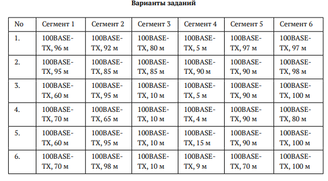

---
## Author
author:
  name: Агаева Зейнаб Фуад кызы
  email: 1032245473@rudn.ru
  affiliation:
    - name: Российский университет дружбы народов
      country: Российская Федерация
      postal-code: 117198
      city: Москва
      address: ул. Миклухо-Маклая, д. 6

## Title
title: Домашнее задание №2
subtitle: Расчёт сети Fast Ethernet
license: CC BY
date: today
date-format: "YYYY-MM-DD"
---

---
title: Расчёт сети Fast Ethernet
subtitle: Лабораторная работа №10
license: CC BY
date: today
date-format: "YYYY-MM-DD"
---

# Цели и задачи работы

## Цель лабораторной работы

Оценить работоспособность сети Fast Ethernet `100BASE-TX` по первой и второй моделям расчёта.

# Условие задания

## Таблица вариантов

{ #fig:001 width=80% height=80% }

## Топология сети

{ #fig:002 width=75% height=75% }

# Процесс выполнения работы

## Анализирую исходную сеть

Рассматриваю сеть `100BASE-TX`, состоящую из пяти узлов и двух повторителей класса II.

Проверяю длины сегментов и определяю наиболее длинные пути между оконечными узлами.

## Использую первую модель Fast Ethernet

Для первой модели проверяю диаметр домена коллизий.

Для путей через один повторитель допустимое значение составляет `200 м`.

Для путей через два повторителя класса II допустимое значение составляет `205 м`.

## Использую вторую модель Fast Ethernet

Для второй модели рассчитываю время двойного оборота сигнала.

В расчёте учитываю:

- задержку пары терминалов TX;
- задержку кабельных сегментов;
- задержку повторителей класса II;
- дополнительный запас `4 би`.

Сеть считается работоспособной, если результат не превышает `512 би`.

# Расчёт вариантов

## Проверяю вариант 1

Максимальный путь через два повторителя:

`D = 96 + 5 + 97 = 198 м`.

Время двойного оборота:

`T = 100 + 198 · 1,112 + 2 · 92 + 4 = 508,176 би`.

Вариант 1 удовлетворяет требованиям обеих моделей.

## Проверяю вариант 2

Максимальный путь через два повторителя:

`D = 95 + 90 + 98 = 283 м`.

Время двойного оборота:

`T = 100 + 283 · 1,112 + 2 · 92 + 4 = 602,696 би`.

Вариант 2 не удовлетворяет требованиям обеих моделей.

## Проверяю вариант 3

Максимальный путь через два повторителя:

`D = 95 + 5 + 100 = 200 м`.

Время двойного оборота:

`T = 100 + 200 · 1,112 + 2 · 92 + 4 = 510,4 би`.

Вариант 3 удовлетворяет требованиям обеих моделей.

## Проверяю вариант 4

Максимальный путь через два повторителя:

`D = 70 + 4 + 90 = 164 м`.

Время двойного оборота:

`T = 100 + 164 · 1,112 + 2 · 92 + 4 = 470,368 би`.

Вариант 4 удовлетворяет требованиям обеих моделей.

## Проверяю вариант 5

Максимальный путь через два повторителя:

`D = 95 + 15 + 100 = 210 м`.

Время двойного оборота:

`T = 100 + 210 · 1,112 + 2 · 92 + 4 = 521,52 би`.

Вариант 5 не удовлетворяет требованиям обеих моделей.

## Проверяю вариант 6

Максимальный путь через два повторителя:

`D = 98 + 9 + 100 = 207 м`.

Время двойного оборота:

`T = 100 + 207 · 1,112 + 2 · 92 + 4 = 518,184 би`.

Вариант 6 не удовлетворяет требованиям обеих моделей.

# Результаты расчёта

## Сводная таблица

| Вариант | Максимальный путь, м | Время двойного оборота, би | Результат |
|---:|---:|---:|:---|
| 1 | 198 | 508,176 | Работоспособна |
| 2 | 283 | 602,696 | Неработоспособна |
| 3 | 200 | 510,400 | Работоспособна |
| 4 | 164 | 470,368 | Работоспособна |
| 5 | 210 | 521,520 | Неработоспособна |
| 6 | 207 | 518,184 | Неработоспособна |

# Выводы по проделанной работе

## Вывод

В ходе лабораторной работы была выполнена оценка работоспособности сети Fast Ethernet `100BASE-TX`.

Были рассчитаны максимальные расстояния между узлами и время двойного оборота сигнала.

По результатам расчётов установлено, что варианты 1, 3 и 4 удовлетворяют требованиям Fast Ethernet, а варианты 2, 5 и 6 являются неработоспособными.