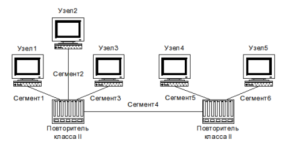

---
## Author
author:
  name: Агаева Зейнаб Фуад кызы
  email: 1032245473@rudn.ru
  affiliation:
    - name: Российский университет дружбы народов
      country: Российская Федерация
      postal-code: 117198
      city: Москва
      address: ул. Миклухо-Маклая, д. 6

## Title
title: "Отчёт по домашнему заданию №2"
subtitle: "Расчёт сети Fast Ethernet"
license: "CC BY"
---

# Цель работы

Цель данной работы— изучение принципов технологий Ethernet и Fast Ethernet и практическое освоение методик оценки работоспособности сети, построенной на базе технологии Fast Ethernet

# Выполнение лабораторной работы

## Условие задания

В лабораторной работе требуется оценить работоспособность сети Fast Ethernet в соответствии с первой и второй моделями расчёта. В начале привожу таблицу вариантов задания (см. рис. [@fig-001]) и используемую топологию сети (см. рис. [@fig-002]).

{ #fig-001 width=80% }

{ #fig-002 width=70% }

## Исходные данные и методика расчёта

Исследуемая сеть построена на основе технологии `100BASE-TX`. В топологии используются пять оконечных узлов и два повторителя класса II. Первый повторитель соединяет узлы 1, 2 и 3, второй повторитель соединяет узлы 4 и 5. Повторители соединены между собой сегментом 4.

Все сегменты выполнены по технологии `100BASE-TX`. Максимальная допустимая длина отдельного сегмента составляет 100 м.

Для проверки сети по первой модели определяю максимальные расстояния между оконечными узлами.

Для узлов, подключённых к первому повторителю:

`D1 = max(L1 + L2; L1 + L3; L2 + L3)`.

Для узлов, подключённых ко второму повторителю:

`D2 = L5 + L6`.

Для узлов, расположенных по разные стороны сети:

`D12 = max(L1; L2; L3) + L4 + max(L5; L6)`.

Пути внутри одной группы проходят через один повторитель класса II, поэтому их длина не должна превышать 200 м. Путь между двумя группами проходит через два повторителя класса II и не должен превышать 205 м.

Для проверки по второй модели рассчитываю время двойного оборота сигнала. Для сети `100BASE-TX` принимаю следующие значения:

- задержка пары терминалов TX — 100 би;
- удельное время двойного оборота витой пары категории 5 — 1,112 би/м;
- задержка одного повторителя класса II с портами TX — 92 би;
- дополнительный запас — 4 би.

Для пути через один повторитель время двойного оборота определяю по формуле:

`T1 = 100 + 1,112 · D + 92 + 4`.

Для пути через два повторителя:

`T2 = 100 + 1,112 · D + 2 · 92 + 4`.

Сеть считается работоспособной по второй модели, если максимальное полученное время двойного оборота не превышает 512 би.

Так как номер варианта отдельно не указан, выполняю расчёт для всех шести вариантов задания.

## Расчёт варианта 1

Длины сегментов:

`L1 = 96 м`, `L2 = 92 м`, `L3 = 80 м`, `L4 = 5 м`, `L5 = 97 м`, `L6 = 97 м`.

Все отдельные сегменты имеют длину не более 100 м.

Для левой части сети получаю:

`D1 = max(96 + 92; 96 + 80; 92 + 80) = max(188; 176; 172) = 188 м`.

Для правой части:

`D2 = 97 + 97 = 194 м`.

Для пути между узлами, расположенными по разные стороны сети:

`D12 = max(96; 92; 80) + 5 + max(97; 97) = 96 + 5 + 97 = 198 м`.

Полученные значения удовлетворяют ограничениям первой модели:

`188 < 200 м`;

`194 < 200 м`;

`198 < 205 м`.

Следовательно, по первой модели сеть варианта 1 работоспособна.

Наибольшее время двойного оборота соответствует пути через два повторителя:

`T = 100 + 198 · 1,112 + 2 · 92 + 4`;

`T = 100 + 220,176 + 184 + 4 = 508,176 би`.

Полученное значение меньше 512 би:

`508,176 < 512`.

Следовательно, сеть варианта 1 работоспособна и по второй модели.

## Расчёт варианта 2

Длины сегментов:

`L1 = 95 м`, `L2 = 85 м`, `L3 = 85 м`, `L4 = 90 м`, `L5 = 90 м`, `L6 = 98 м`.

Все отдельные сегменты имеют допустимую длину.

Для левой части:

`D1 = max(95 + 85; 95 + 85; 85 + 85) = 180 м`.

Для правой части:

`D2 = 90 + 98 = 188 м`.

Для пути через оба повторителя:

`D12 = max(95; 85; 85) + 90 + max(90; 98)`;

`D12 = 95 + 90 + 98 = 283 м`.

Допустимая длина пути через два повторителя класса II составляет 205 м, при этом:

`283 > 205`.

Следовательно, сеть варианта 2 не удовлетворяет требованиям первой модели.

Проверяю вторую модель:

`T = 100 + 283 · 1,112 + 2 · 92 + 4`;

`T = 100 + 314,696 + 184 + 4 = 602,696 би`.

Получаю:

`602,696 > 512`.

Сеть варианта 2 неработоспособна и по второй модели.

## Расчёт варианта 3

Длины сегментов:

`L1 = 60 м`, `L2 = 95 м`, `L3 = 10 м`, `L4 = 5 м`, `L5 = 90 м`, `L6 = 100 м`.

Длины отдельных сегментов находятся в допустимых пределах.

Для левой части:

`D1 = max(60 + 95; 60 + 10; 95 + 10)`;

`D1 = max(155; 70; 105) = 155 м`.

Для правой части:

`D2 = 90 + 100 = 190 м`.

Для пути через оба повторителя:

`D12 = max(60; 95; 10) + 5 + max(90; 100)`;

`D12 = 95 + 5 + 100 = 200 м`.

Проверяю первую модель:

`155 < 200 м`;

`190 < 200 м`;

`200 < 205 м`.

Все ограничения выполняются, поэтому сеть варианта 3 работоспособна по первой модели.

Для наиболее неблагоприятного пути время двойного оборота равно:

`T = 100 + 200 · 1,112 + 2 · 92 + 4`;

`T = 100 + 222,4 + 184 + 4 = 510,4 би`.

Получаю:

`510,4 < 512`.

Следовательно, сеть варианта 3 работоспособна по второй модели.

## Расчёт варианта 4

Длины сегментов:

`L1 = 70 м`, `L2 = 65 м`, `L3 = 10 м`, `L4 = 4 м`, `L5 = 90 м`, `L6 = 80 м`.

Все отдельные сегменты удовлетворяют ограничению по длине.

Для левой части:

`D1 = max(70 + 65; 70 + 10; 65 + 10)`;

`D1 = max(135; 80; 75) = 135 м`.

Для правой части:

`D2 = 90 + 80 = 170 м`.

Для пути между левой и правой частями сети:

`D12 = max(70; 65; 10) + 4 + max(90; 80)`;

`D12 = 70 + 4 + 90 = 164 м`.

Проверяю первую модель:

`135 < 200 м`;

`170 < 200 м`;

`164 < 205 м`.

Сеть варианта 4 удовлетворяет требованиям первой модели.

Несмотря на то, что расстояние между узлами 4 и 5 равно 170 м, путь между разными повторителями содержит два повторителя класса II и вносит большую временную задержку.

Для пути через два повторителя:

`T12 = 100 + 164 · 1,112 + 2 · 92 + 4`;

`T12 = 100 + 182,368 + 184 + 4 = 470,368 би`.

Для пути между узлами 4 и 5 через один повторитель:

`T2 = 100 + 170 · 1,112 + 92 + 4`;

`T2 = 100 + 189,04 + 92 + 4 = 385,04 би`.

Максимальным является значение `470,368 би`.

`470,368 < 512`.

Следовательно, сеть варианта 4 работоспособна по второй модели.

## Расчёт варианта 5

Длины сегментов:

`L1 = 60 м`, `L2 = 95 м`, `L3 = 10 м`, `L4 = 15 м`, `L5 = 90 м`, `L6 = 100 м`.

Все отдельные сегменты имеют допустимую длину.

Для левой части:

`D1 = max(60 + 95; 60 + 10; 95 + 10) = 155 м`.

Для правой части:

`D2 = 90 + 100 = 190 м`.

Для пути через оба повторителя:

`D12 = max(60; 95; 10) + 15 + max(90; 100)`;

`D12 = 95 + 15 + 100 = 210 м`.

Полученное значение превышает допустимые 205 м:

`210 > 205`.

Следовательно, сеть варианта 5 не удовлетворяет первой модели.

Проверяю вторую модель:

`T = 100 + 210 · 1,112 + 2 · 92 + 4`;

`T = 100 + 233,52 + 184 + 4 = 521,52 би`.

Получаю:

`521,52 > 512`.

Следовательно, сеть варианта 5 неработоспособна по второй модели.

## Расчёт варианта 6

Длины сегментов:

`L1 = 70 м`, `L2 = 98 м`, `L3 = 10 м`, `L4 = 9 м`, `L5 = 70 м`, `L6 = 100 м`.

Каждый отдельный сегмент имеет длину не более 100 м.

Для левой части:

`D1 = max(70 + 98; 70 + 10; 98 + 10)`;

`D1 = max(168; 80; 108) = 168 м`.

Для правой части:

`D2 = 70 + 100 = 170 м`.

Для пути через два повторителя:

`D12 = max(70; 98; 10) + 9 + max(70; 100)`;

`D12 = 98 + 9 + 100 = 207 м`.

Полученное расстояние превышает допустимые 205 м:

`207 > 205`.

Сеть варианта 6 не удовлетворяет требованиям первой модели.

Время двойного оборота для наиболее неблагоприятного пути:

`T = 100 + 207 · 1,112 + 2 · 92 + 4`;

`T = 100 + 230,184 + 184 + 4 = 518,184 би`.

Получаю:

`518,184 > 512`.

Следовательно, сеть варианта 6 неработоспособна по второй модели.

## Результаты расчёта

| Вариант | Максимальный путь через два повторителя, м | Проверка первой модели | Максимальное время двойного оборота, би | Проверка второй модели |
|---:|---:|:---:|---:|:---:|
| 1 | 198 | выполняется | 508,176 | выполняется |
| 2 | 283 | не выполняется | 602,696 | не выполняется |
| 3 | 200 | выполняется | 510,400 | выполняется |
| 4 | 164 | выполняется | 470,368 | выполняется |
| 5 | 210 | не выполняется | 521,520 | не выполняется |
| 6 | 207 | не выполняется | 518,184 | не выполняется |

# Вывод

В ходе лабораторной работы была выполнена оценка работоспособности сети Fast Ethernet `100BASE-TX` по первой и второй моделям. Были рассчитаны максимальные расстояния между узлами и время двойного оборота сигнала с учётом задержек кабеля, повторителей и оконечных устройств. По результатам расчётов определено, какие варианты сети соответствуют требованиям Fast Ethernet.